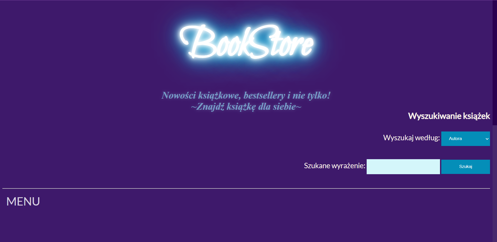
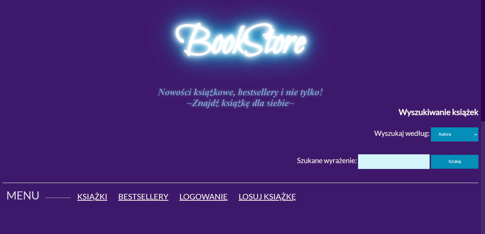
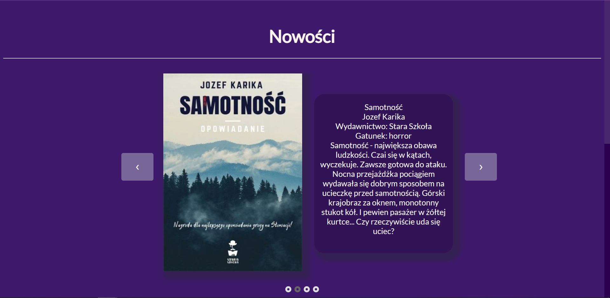
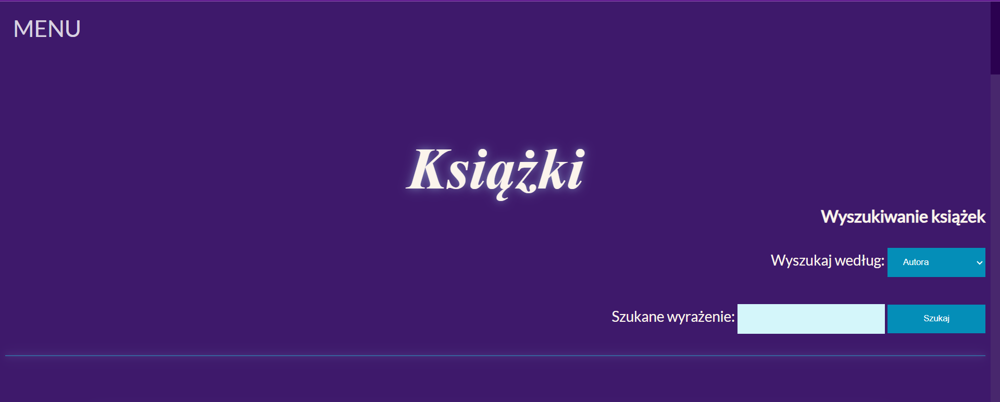
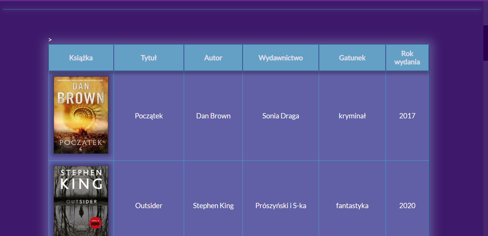
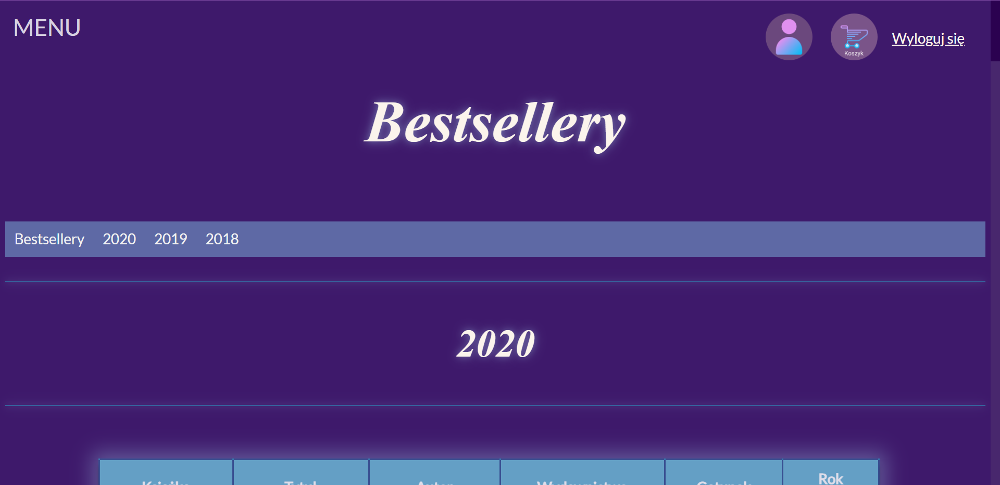
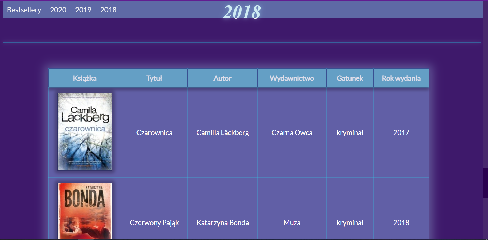
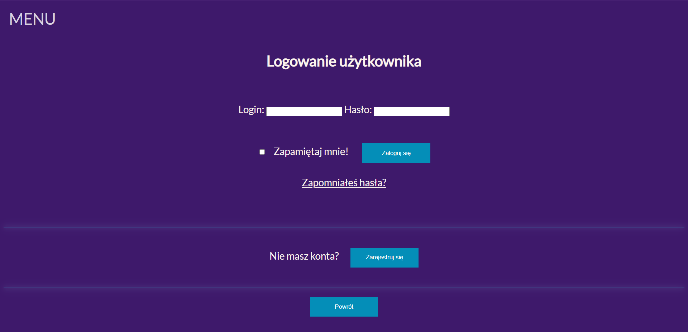
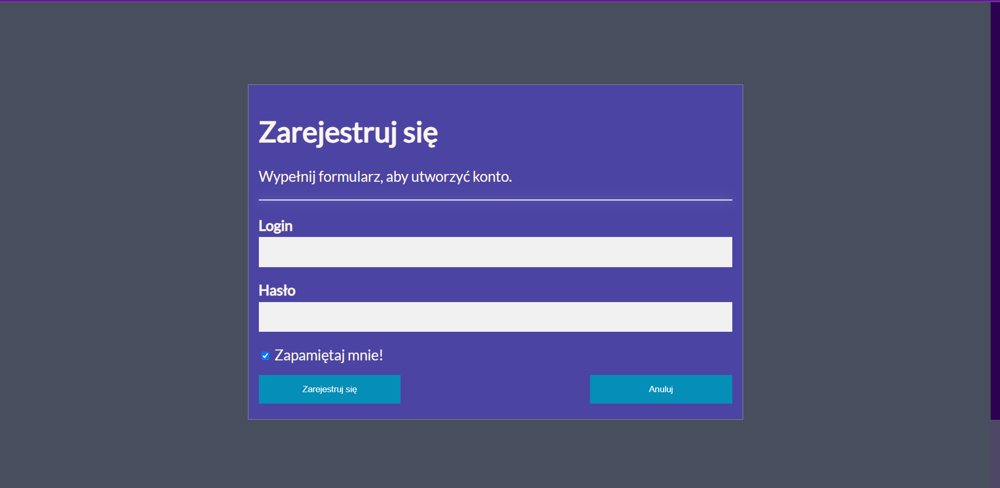
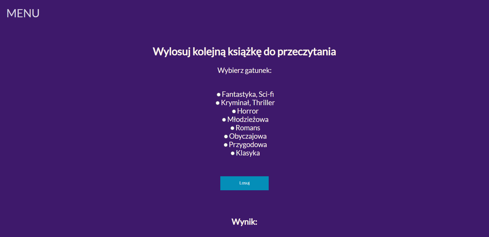

# Bookshop website
Simple bookshop website, using HTML, JavaScript and CSS and PHP.  
Project created for university classes.  
>App developed: April - May 2020

## Table of Contents
* [General Info](#general-information)
* [Technologies Used](#technologies-used)
* [Features](#features)
* [Screenshots](#screenshots)
* [Project Status](#project-status)

## General Information
Simple bookshop website.  
Developed using HTML, JavaScript and CSS for frontend and PHP for backend.  
Project developed for university classes, with focus on learning and practice of developing web applications.  
Application data was stored in a local MySQL database.

## Technologies Used
- HTML
- CSS
- JavaScript
- PHP
- MySQL

## Features
App features:
- Displaying best new books on home page
- User account - login and registering
- Restoring user password
- User profile page
- Displaying all the books available in a bookshop
- Displaying bestsellers for specific year
- User shopping cart 
- Adding books to user cart
- Picking random book to read for user based on specified criteria

## Screenshots

Home page:

Menu - expanding on hover:

Home page - promoted new books:

Displaying all availables books:

Bestsellers:

User login page:

User register page:

Picking book to read for user:

## Project Status
Project is: _complete_  
Currently project is completed. All planned features have been implemented.  
Project was developed from April to May 2020.  
Project developed as fist practice of web application development.

